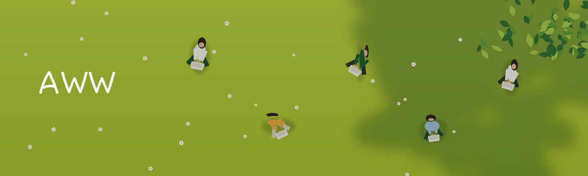

  

<h1 align="center">awwwdde</h1>

  Портфолио веб-разработчика — и платформа, на которой оно живёт.

  <a href="https://awwwdde.art">awwwdde.art</a>

---

## Что это

Личный сайт: главная с живой иллюстрацией, страница работ, рассказ о себе
и форма связи. Два языка, светлая и тёмная темы.

Под сайтом — своя небольшая платформа. Каждый проект из портфолио можно
развернуть отдельным сайтом на своём поддомене: у него собственная база,
собственный сертификат и собственные графики нагрузки. Всё это управляется
из админки: список стендов, их состояние, тексты сайта, входящие заявки.

Сделано целиком одним человеком — от первого экрана до сервера, на котором
это крутится.

## Из чего собрано

**Фронтенд** — Next.js на App Router, TypeScript, Tailwind. Первый экран
рисуется на Three.js: поляна с высоты, люди за ноутбуками, тени от кроны.
Сцена процедурная, не видео и не картинка — ветер, покачивание и параллакс
считаются в реальном времени.

**Бэкенд** — FastAPI и Postgres. Разворачивает гостевые сайты в контейнерах,
выписывает им домены и сертификаты, снимает нагрузку и показывает её
графиками.

**Инфраструктура** — Docker и Caddy на одном сервере.

## Документация

| Файл | О чём |
|---|---|
| [ARCHITECTURE.md](ARCHITECTURE.md) | Как всё устроено внутри |
| [DEPLOY.md](DEPLOY.md) | Развернуть платформу с нуля |
| [GUEST.md](GUEST.md) | Требования к проекту, который разворачивается стендом |

## Связь

Почта — на [странице контакта](https://awwwdde.art/contact).

  Сделано в Москве

cd /opt/awwwdde
git pull
docker compose up -d --build

docker compose ps
docker compose logs panel --tail 20
curl -s https://awwwdde.art/healthz